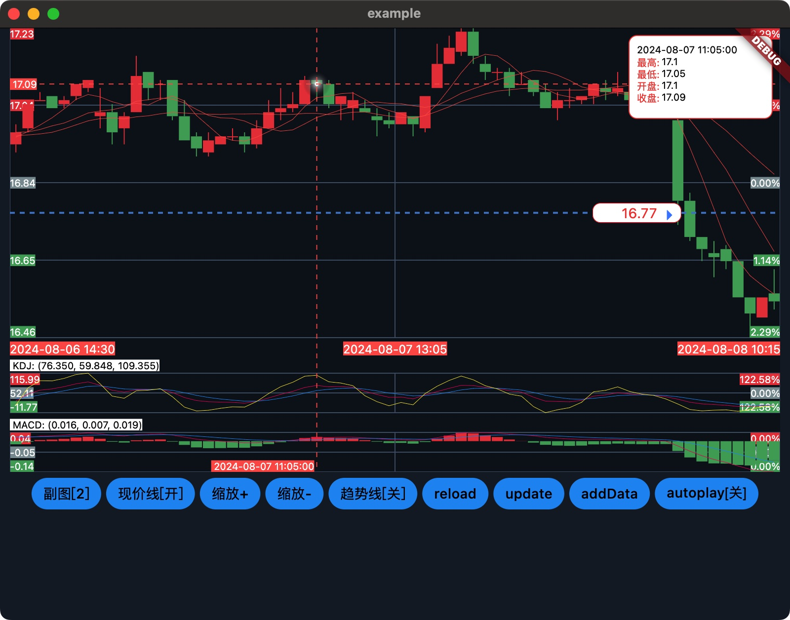
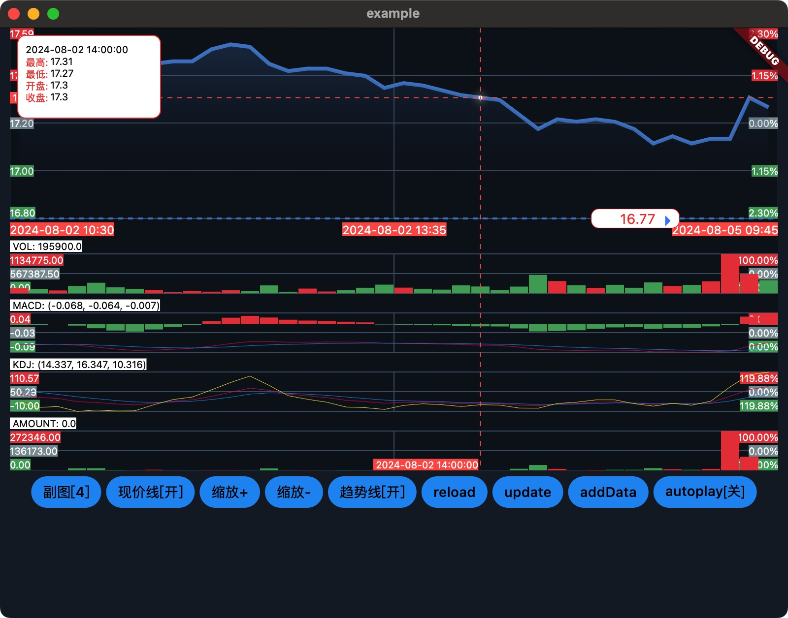

# hchart_flutter

#### 介绍
hchart_flutter 为 HChart 的flutter版本。

#### 示例图

## 为什么需要 HChart
- 追求极致的性能体验

目前有很多基于H5技术的优秀图表库，例如TradingView、echart等，在浏览器上实现了强大的绘制能力和渲染速度，以及最重要的跨平台性。然而无论如何优化，H5图表在大量数据刷新和复杂图形渲染、原生事件响应上，难以达到原生的性能效果。

- 支持多平台

当前需要支持的平台种类较多，移动端有iOS、Android，以及新诞生的鸿蒙，桌面端有macOS、Windows、Linux。每个操作系统都的技术栈有很大的差异，市面上原生的图表库大多基于单平台实现，无法支持多平台。

- 满足专业化功能要求

股票线图包含更专业的业务知识，普通图表库无法完全满足股票线图对业务功能的要求，进行定制化扩展较为困难。

- 降低迁移成本

由于不同平台导致的技术壁垒，单个平台上成熟的图表库大多与本平台开发语言技术深度绑定。图表库偏向于具体实现，而缺乏统一的框架设计，难以快速迁移到其他平台。

因此，HChart将主要针对如下几个痛点给出方案：

- 提高性能体验 -> 原生实现
- 支持多平台 -> 基于flutter提供多平台支持，或直接提供原生平台支持
- 满足专业化 -> 深度结合专业化需求
- 降低迁移成本 -> 基于canvas绘制，重于框架设计

## 什么是 HChart？
HChart是一个基于canvas绘制机制的多平台原生股票图表框架。提供高性能的、易于功能扩展和定制化的、跨平台的证券可视化图表绘制框架。目前已提供基于flutter的跨平台组件库，也提供iOS、鸿蒙原生实现组件库。同时作为基于canvas的绘制框架，易于迁移到其他原生系统平台。
## HChart 的特点
通过定义可以看出，HChart有以下几个关键特点：

- 基于canvas绘图

HChart基于canvas绘制机制，实现图表底层绘制。狭义上的Canvas通常指的是HTML5 Canvas技术，但各个主流原生系统重提供了类似标准的实现，例如iOS 和 macOS 的 Core Graphics、Android 的 Canvas 类、Windows 平台有 Direct2D 和 WPF 中的 DrawingContext等。因此，采用基于canvas绘制方式，可以在各个平台的渲染层取得较好的统一效果。

- 多平台

HChart目前已支持部分原生平台的图表库的基础实现。同时重点提供flutter版本，性能体验上与原生技术栈实现差别不大。

- 原生实现

HChart关注渲染性能，采用原生或flutter方式进行实现。

- 股票图表

HChart面向证券行情交易中的线图功能，提供丰富的图表绘制能力。提供专业化适配，参考主流股票软件支持分时走势、K线、常见指标等。

- 框架

HChart虽然直接提供图表组件库，但更多的是一种绘制框架，通过提供合理的架构设计思想，方便在任何有canvas支持的原生系统上，实现一套股票图表绘制组件。
## HChart设计目标
HChart的设计目标在概念中已有体现，即基于canvas、支持多平台、原生实现、专业化股票图表、框架设计。
除此之外，HChart也将致力于以下几个目标：

- 更高的性能体验
- 更专业的业务功能
- 更易用的集成方式
- 更通用的功能扩展方式

